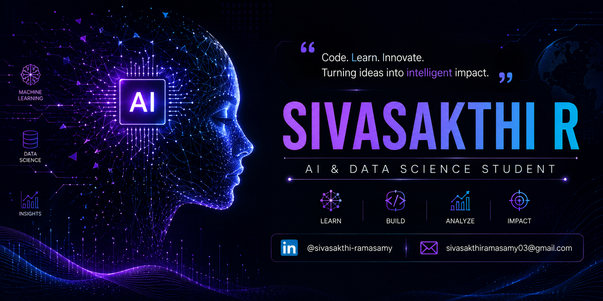

<div align="center">



<br/>

<a href="https://readme-typing-svg.herokuapp.com">
  
</a>

<br/>

&nbsp;

<br/><br/>

<a href="https://drive.google.com/file/d/1Ko5FJ6vCSGX8_utgGcIUm-rOQa2tkU2z/view?usp=sharing"></a>&nbsp;<a href="https://www.linkedin.com/in/sivasakthi-ramasamy-b21ab2281"></a>&nbsp;<a href="mailto:sivasakthiramasamy03@gmail.com"></a>

<br/><br/>


</div>

<br/>

<hr/>

<!-- ============================================================ -->
<!--  ABOUT                                                        -->
<!-- ============================================================ -->


Hello — I'm **Sivasakthi Ramasamy**, an AI & Data Science undergraduate building software at the intersection of machine learning, computer vision, and full-stack engineering. I work across the stack: training models, designing APIs, and shipping the interfaces people actually use. My focus is turning research-shaped ideas into products that hold up in the real world.

<br/>

<table width="100%">
<tr>
<td align="center" width="33%">

**Education**
<sub>B.Tech, AI & Data Science<br/>KGiSL Institute of Technology</sub>

</td>
<td align="center" width="33%">

**Location**
<sub>Tamil Nadu, India</sub>

</td>
<td align="center" width="34%">

**Status**
<sub>Open to internships & collaboration</sub>

</td>
</tr>
<tr>
<td align="center" width="33%">

**Core Interests**
<sub>AI · ML · Computer Vision · Full-Stack</sub>

</td>
<td align="center" width="33%">

**Objective**
<sub>Building human-centered, production-grade AI systems</sub>

</td>
<td align="center" width="34%">

**Currently**
<sub>Shipping CareerLens AI & POS Billing</sub>

</td>
</tr>
</table>

<br/>

<!-- ============================================================ -->
<!--  CURRENT FOCUS                                                -->
<!-- ============================================================ -->


<table width="100%">
<tr>
<th width="25%">Building</th>
<th width="25%">Learning</th>
<th width="25%">Exploring</th>
<th width="25%">Open To</th>
</tr>
<tr>
<td valign="top">

<br/>
<br/>


</td>
<td valign="top">

<br/>
<br/>


</td>
<td valign="top">

<br/>
<br/>


</td>
<td valign="top">

<br/>
<br/>


</td>
</tr>
</table>

<br/>

<!-- ============================================================ -->
<!--  FEATURED PROJECTS                                            -->
<!-- ============================================================ -->


<details open>
<summary><b>CareerLens AI</b> — AI-powered resume intelligence platform</summary>
<br/>

An AI-powered resume analyzer that delivers real-time ATS scoring, NLP-driven feedback, and personalized career-path recommendations.

**Highlights**
- Resume parsing and structured extraction pipeline
- ATS scoring engine benchmarked against real job descriptions
- NLP-based skill-gap detection and career recommendations

`Python` `Django` `NLP`

[](https://github.com/sivasakthi-15/CareerLensAI)

</details>

<details>
<summary><b>Sivasakthi POS Billing System</b> — Multi-shop GST billing platform</summary>
<br/>

A production-ready billing engine for multiple retail outlets, handling GST-compliant invoicing, thermal-printer output, and contractor billing on a MongoDB-backed inventory pipeline.

**Highlights**
- Multi-shop architecture with isolated inventory and billing state
- GST-compliant invoice generation and thermal-printer integration
- Real-time inventory sync across shop and contractor workflows

`React` `Node.js` `MongoDB`

[](https://github.com/sivasakthi-15/Sivasakthi_Electricals)

</details>

<details>
<summary><b>Autonomous Vehicles · V2V Communication</b> — Cooperative driving research platform</summary>
<br/>

A research-grade autonomous driving platform built on ROS2 and CARLA, implementing real-time perception, cooperative driving logic, and vehicle-to-vehicle communication.

**Highlights**
- ROS2 node architecture for modular perception and control
- CARLA-simulated environment for cooperative driving scenarios
- Vehicle-to-vehicle messaging layer for coordinated maneuvers

`ROS2` `OpenCV` `CARLA`

[](https://github.com/Sanjay-Mathivanan/Autonomous-Vehicles-with-V2V-Communication-for-Cooperative-Driving)

</details>

<details>
<summary><b>AI Negotiation Agent</b> — LLM-powered negotiation engine</summary>
<br/>

A negotiation engine powered by locally-hosted LLMs, simulating strategic, human-like bargaining conversations without any cloud dependency.

**Highlights**
- Local LLM inference pipeline via Ollama
- Strategy-aware negotiation prompting
- Conversational agent design tuned for realistic back-and-forth

`Python` `Ollama` `LLM`

[](https://github.com/Sanjay-Mathivanan/AI-NEGOTIATION-AGENT)

</details>

<br/>

<!-- ============================================================ -->
<!--  TECH STACK                                                   -->
<!-- ============================================================ -->


<details open>
<summary><b>Languages</b></summary>
<br/>


</details>

<details>
<summary><b>AI, Machine Learning & Computer Vision</b></summary>
<br/>


</details>

<details>
<summary><b>Frontend & Backend</b></summary>
<br/>


</details>

<details>
<summary><b>Robotics & Simulation</b></summary>
<br/>


</details>

<details>
<summary><b>Databases & Tools</b></summary>
<br/>


</details>

<br/>

<!-- ============================================================ -->
<!--  DEVELOPER DASHBOARD                                          -->
<!-- ============================================================ -->


<div align="center">


</div>

<br/>

<!-- ============================================================ -->
<!--  CURRENTLY BUILDING                                           -->
<!-- ============================================================ -->


```text
CareerLens AI          ██████████████░░░░░░  70%
Sivasakthi POS Billing ████████████████░░░░  80%
Autonomous Vehicles    ██████████░░░░░░░░░░  50%
AI Negotiation Agent   ████████████░░░░░░░░  60%
```

<sub>Progress values are self-reported estimates — update them as each build moves forward.</sub>

<br/>

<!-- ============================================================ -->
<!--  ACHIEVEMENTS                                                 -->
<!-- ============================================================ -->


<details>
<summary><b>View achievements</b></summary>
<br/>

| Achievement | Description |
|---|---|
| 🏅 Built Smart POS Billing System | Developed a full-stack POS application with GST billing, inventory management, customer management, analytics, and reporting. |
| 🤖 Developed CareerLens AI | Created an AI-powered Resume Analyzer with ATS scoring, skill gap analysis, and career recommendations. |
| 💻 Active LeetCode Problem Solver | Consistently solving Data Structures & Algorithms problems to strengthen problem-solving skills. |
| 🚀 Built Multiple Full Stack Projects | Designed and developed scalable web applications using React, Node.js, Express.js, MongoDB, and Python. |
| 🌟 Open Source Learner | Continuously improving through GitHub projects, hackathons, and modern software development practices. |
<sub>No achievements were provided yet — replace these rows with hackathon wins, competition ranks, or other recognitions.</sub>

</details>

<br/>

<!-- ============================================================ -->
<!--  CERTIFICATES                                                 -->
<!-- ============================================================ -->


<details>
<summary><b>View certificates</b></summary>
<br/>

| Certificate | Issuer | Year |
|---|---|---|
| Data Analyst Internship Certificate | Elevate Labs | 2025 |
| Full Stack Development Internship | Appin Technology | 2025 |
| Data Science Internship | SkillCraft Technology | 2025 |
| HTML Certificate | SoloLearn | 2025 |
| Python Certificate | SoloLearn | 2025 |
| SQL Certificate | SoloLearn | 2025 |
| Java Certificate | SoloLearn | 2025 |
| JavaScript Certificate | SoloLearn | 2025 |
| Multiple AI, ML & Data Science Certificates (50+) | Coursera | 2024–2026 |
| NCC 'B' Certificate | National Cadet Corps (NCC) | 2024 |
| NCC 'C' Certificate | National Cadet Corps (NCC) | 2025 |

<sub>No certificates were provided yet — replace these rows with your actual credentials.</sub>

</details>

<br/>

<!-- ============================================================ -->
<!--  CODING PROFILES                                              -->
<!-- ============================================================ -->


<div align="center">

<a href="https://leetcode.com/Sakthi-15"></a>
<a href="https://www.hackerrank.com/@sivasakthiramas1"></a>
<a href="https://www.codechef.com/users/sivasakthi_15"></a>
</a>

<sub>Usernames are placeholders — swap in your actual handles.</sub>

</div>

<br/>

<!-- ============================================================ -->
<!--  CONTACT                                                      -->
<!-- ============================================================ -->


<div align="center">

<a href="https://www.linkedin.com/in/sivasakthi-ramasamy-b21ab2281"></a>
<a href="mailto:sivasakthiramasamy03@gmail.com"></a>
<a href="YOUR_PORTFOLIO_URL"></a>
<a href="YOUR_RESUME_LINK"></a>

</div>

<br/>

<hr/>

<div align="center">
<br/>

<sub>Built with Python, React, coffee, and curiosity.</sub>

</div>
